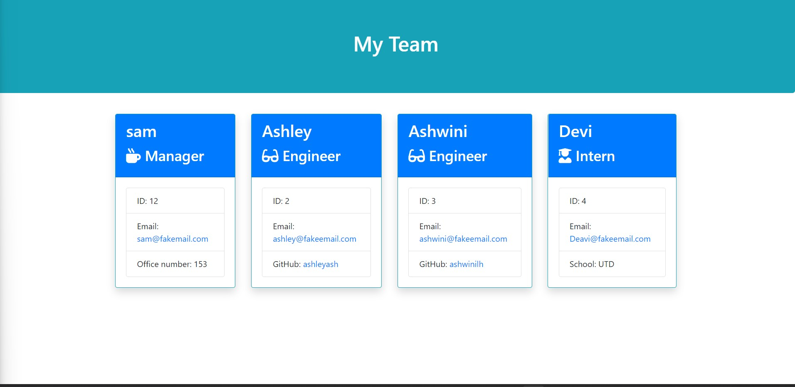

# Team-Profile-generator

1. Created a repo "Team-Profile-generator" https://github.com/ashwinilh/Team-Profile-generator
2. This repo is for challenge 10 of UT boot camp to  build a Node.js command-line application that takes in information about employees on a software engineering team and generates an HTML webpage that displays summaries for each person
3.  Created folder structure
4. Addwed initial code.
5. Added employee class, then Manager, Engineer and Intern class.
6. Added inquirer questions to generate team and generated html data.
7. Added code for write file
8. Added validation for email,ID and office number
9. Added prompt questions.